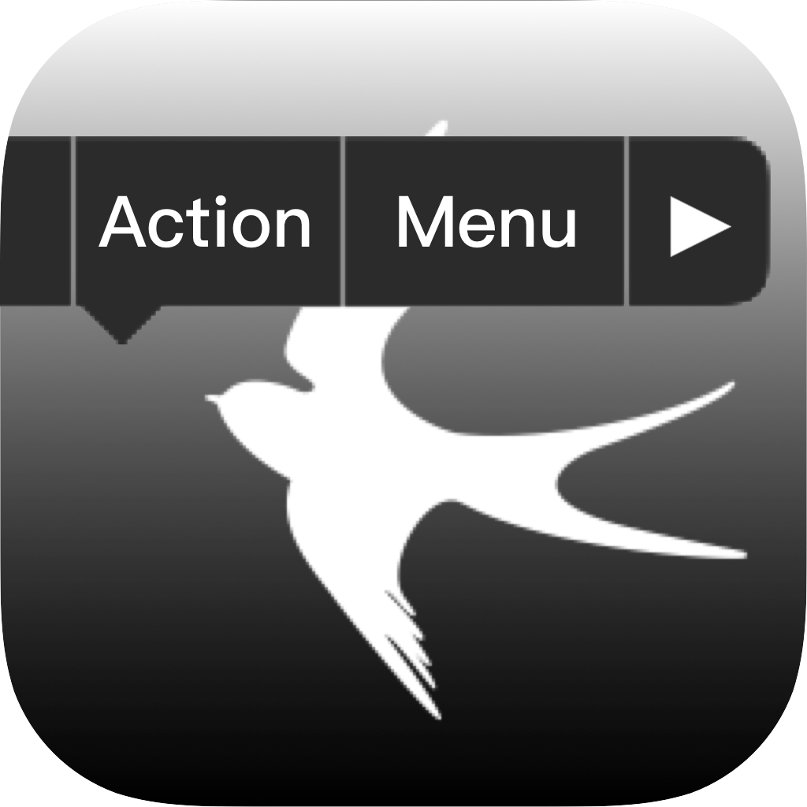
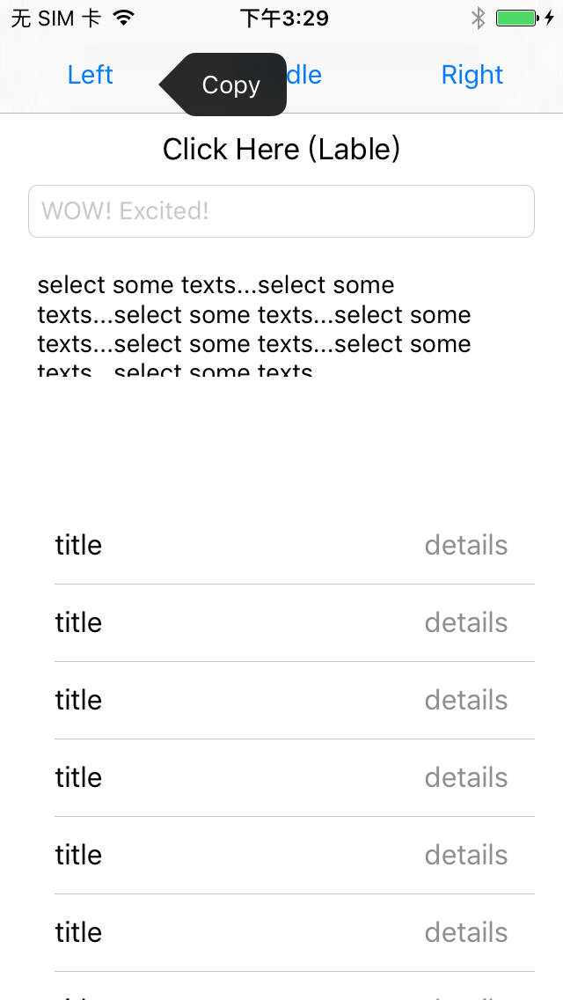
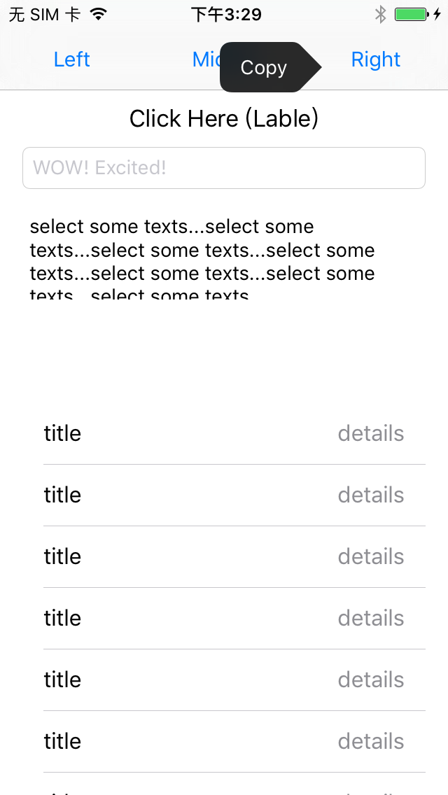
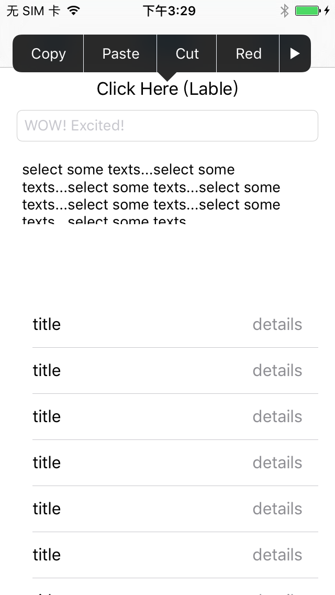
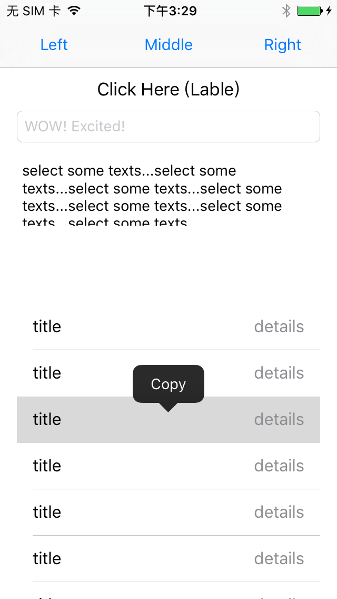
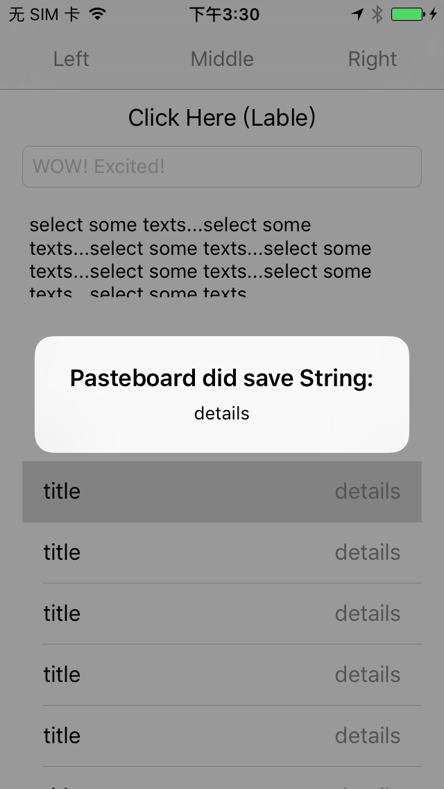
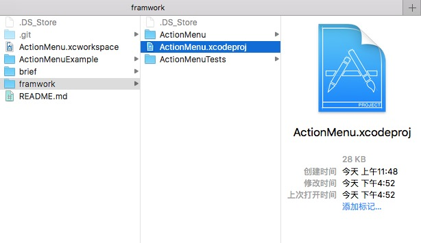

# ActionMenu

Readme content will be expressed in both English and Chinese.

内容将会用英语和中文进行表述.

=========
Easy call / dismiss Action menu bar like  

简单一行代码 呼出／隐藏 如上图的 动作菜单

## Features of Reformation in Swift implement

* Manualable define action
* interact with UIView
* available on iOS
* delegate-able reformed
* implement with Swift

实现的封装，包括特性：

* 完全自定义动作
* 可以和UIView等控件的交互
* 在iOS可用
* 封装了一个代理
* 用Swift实现

## Run Example Brief

## Usage

### ActionMenu.swift

> ###### ActionMenu
> 
>init : 构造方法
>
>	convenience public init(actions:[UIMenuItem], direction: UIMenuControllerArrowDirection?, inView: UIView)
>
>delegate : 代理
>
>	public weak var delegate: ActionMenuDelegate?
>
>show : 呼出
>
>	public func show(animated animated: Bool, handler completion: (Void) -> Void) -> Void
>
>dismiss : 隐藏
>
>	public func dismiss(animated animated: Bool, handler completion: (Void) -> Void) -> Void
>
> 
>
> ###### protocol ActionMenuDelegate
>
> life cycle control : 生命周期
>
> 	func actionMenuDidDismissed(menu: ActionMenu)
>
> 
>
> ###### protocol ActionableProtocol 
>
> override those functions in UIView or Controller need to be , extension contains the example of override implements
> 
> 在UIView 或者 Controller 里面实现 ActionableProtocol 必须重写的函数 , 在扩展里面有写如何实现的例子
>
>required, must be override implement
>
>	func canPerformAction(action: Selector, withSender sender: AnyObject?) -> Bool
>
>required, must be override implement
>
>	func canBecomeFirstResponder() -> Bool

### UIExtensions+UILable.swift

> ###### ActionLabel 
> 
> "Actionable Protocol" is Inplemented inside. Which provide an example of how to funtion objects with "ActionMenu" with sub-class of UIView 
> 
> 在内部实现了 ActionableProtocol 和点击手势. 查看里面的具体实现可以了解Actionable Protocol在UIView的自类里面是如何被封装的
> 
>   －
>  
>
  Support Actions : 实现了的动作函数
>
> * func cutText() : 剪切
> * func pasteText() : 粘贴
> * func copyText() : 复制
> * func red() : 改变文字颜色－红色
> * func blue() : 改变文字颜色－蓝色
> * func green() : 改变文字颜色－绿色
>
>
>

## Install

Just Drag *#framework/ActionMenu.xcodeproj#* to your project or xcworkspace

把 *ActionMenu.xcodeproj* 拖进 项目或者工作台 去就行了

## Contact
if you have any question,contact me.

有问题找大哥

email:xxvk@outlook.com

wechat:phrekn

